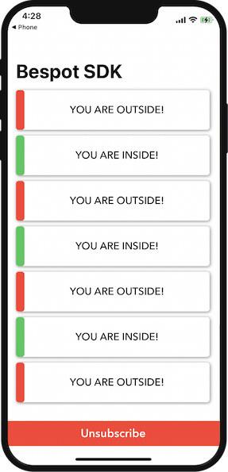

# Bespot Assessment iOS SDK

BTAssessmentSDK offers indoor location tracking and analytics reporting to 3rd party apps using BLE technology and Machine Learning.




## Features

- [x] Indoor location (in/out)
- [ ] Indoor area detection
- [ ] Outdoor location
- [ ] Analytics

## Requirements
- iOS 13.0+
- Xcode 12

## Installation

### CocoaPods

You can use [CocoaPods](https://cocoapods.org) to install _BTAssessmentSDK_. See steps below:

 1. Add _BTAssessmentSDK_ dependency to your _Podfile_ - using git link and tag(version). See sample code hereby:

```
# Minimum supported iOS platform for BTAssessmentSDK
platform :ios, '10.0'
target '[Your app]' do
  # Needed for the project to use frameworks
  user_frameworks!

  # BTAssessmentSDK framework
  pod 'BTAssessmentSDK', :git => 'https://github.com/bespot/assessment-sdk-ios', :tag => '1.0.0'

  # Other Cocoapods libraries/frameworks you may use...

end
```

 2. Run `pod update` for the Cocoapods to download the _BTAssessmentSDK_ dependency.
 3. Run `pod install`


## Usage example

### Initialization

Do the framework import:

```swift
  import BTAssessmentSDK
```

### Use the `BTInOutDelegate` delegate to receive InOut updates

In your view controller's `viewDidLoad()` method add this:

```swift
BTAssessmentSDK.shared.delegate = self
```

Extend your view controller to implement delegate method:

```swift
extension YourViewController: BTInOutDelegate {

    func didUpdateResult(status: BTStatus) {
        // TODO: Use In-Out status
    }

    func didFailUpdate(error: BTError) {
      // TODO: Inspect possible errors  
    }
}
```

### Subscribe for InOut status updates

In order for the solution (mock) to start provide your with location updates
(inside or outside) regarding you location in relation to the store, you
have to use this:

```swift
BTAssessmentSDK.shared.subscribe()
```

### Unsubscribe from updates

To unsubscribe from updates just use this:

```swift
BTAssessmentSDK.shared.unsubscribe()
```
